# What Are B-Trees? 
A **B-Tree** is a self-balancing search tree where each node contains multiple values/keys with multiple children. Essentially each node can have $k$ number of keys, which will make the amount of children they have equal to $k+1$. You can also view this as $t$ number of children and $t-1$ number of keys.

General B-Tree Characteristics:
- Every node, except for the root and the leaves, has at least $t$ children.
- Every node has at most $2t$ children.
- The root node has at least two children unless it is a leaf.
- All leaves appear on the same level.
- Each key regardless of whether it is a leaf or internal node points to data.
- A non-leaf node with k children contains k−1 keys.
- Node will split upon realizing it is inserting in a node that has key values that are equal to $2t-1$ in key values/when $2t$ in chidren are reached

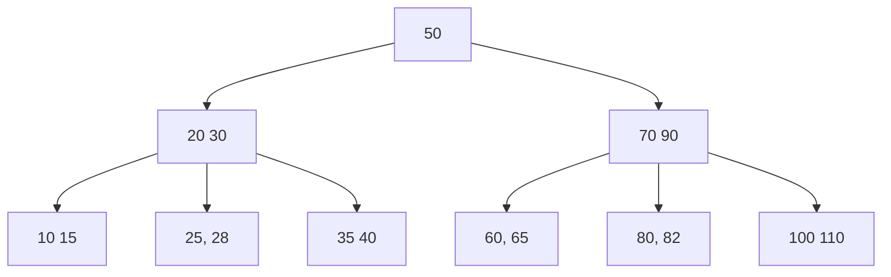


## What $t$ value does this B-Tree have?
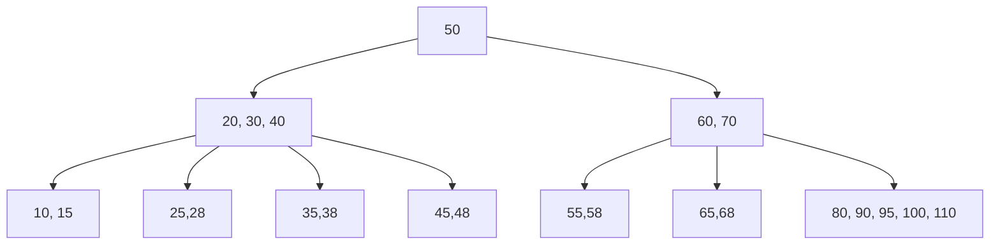


## Insertion:

If we were to insert the number 99 (& remove 110)on the B-Tree you just saw it would now look like this. This is the simplest case of insertion  (assuming t= 3) as the node doesn't exceed the maximum number of keys it can have, which would be 2t-1.

### After inserting 99:
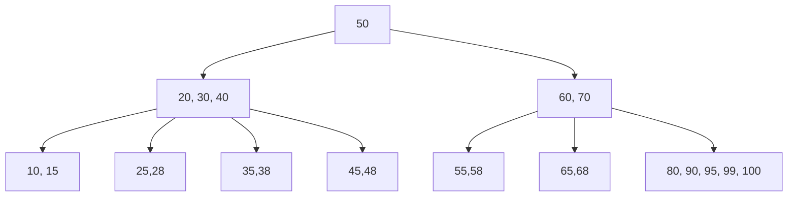

Regular Insert Code:
```ruby
def insert_non_full(key)
      i = @keys.size - 1
  
      if @leaf
        @keys << nil
        while i >= 0 && key < @keys[i]
          @keys[i + 1] = @keys[i]
          i -= 1
        end
        @keys[i + 1] = key
      else
        while i >= 0 && key < @keys[i]
          i -= 1
        end
        i += 1
  
        if @children[i].keys.size == 2 * @t - 1
          split_child(i)
          if key > @keys[i]
            i += 1
          end
        end
        @children[i].insert_non_full(key)
      end
end
```

A more complicated case arises if we were to then insert $102$. This is because the requirement is finally reached in this case the leaf node's number of key values are going to exceed $5$ ($2t-1$). This means that the self-balancing tree will need to split to maintain the balance. 

It does this by chosing one of the median values to insert into the parent node as a key. It then creates a new node so that there can be 2 nodes that represent the values less than the new key and greater than the key

### Before Split (trying to insert once node would exceed values)
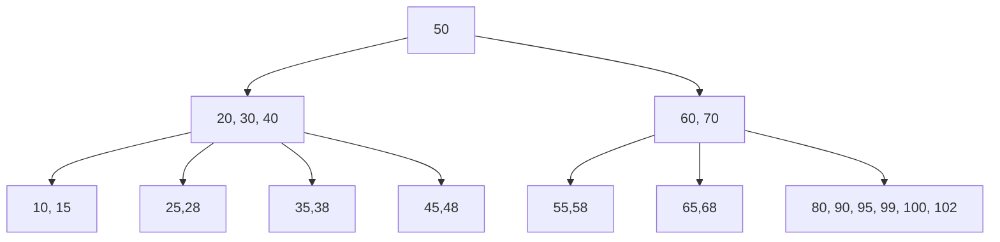
### B-Tree Splits (promoted 95 to parent node)

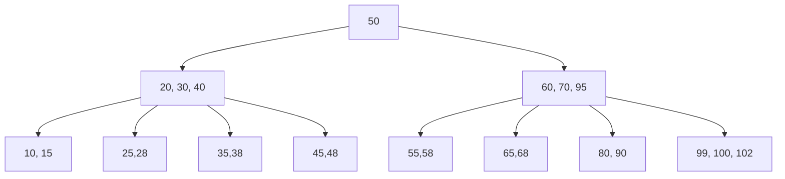
Trostin's Code:
```ruby
    def split_child(i)
      y = @children[i]
      z = BTreeNode.new(@t, y.leaf)
  
      mid_key = y.keys[@t - 1]  # middle key to promote
  
      # Split keys and children
      z.keys = y.keys[@t..-1]
      y.keys = y.keys[0...@t - 1]
  
      unless y.leaf
        z.children = y.children[@t..-1]
        y.children = y.children[0...@t]
      end
  
      @children.insert(i + 1, z)
      @keys.insert(i, mid_key)
    end
  end
```


## Deletion:
This can be a lot more complex as we need to ensure when we delete a key/value that each node still continues to have $t-1$ keys. Moreover, it still needs to be balanced and have all leaf nodes on same level.


### Deleting from leaf node (without causing underflow)
The simplest case is when we delete from a leaf node with the node still satisfying the $t-1$ condition. In case of this tree this would be if we deleted key $100$. The key is simply removed normally as expected.
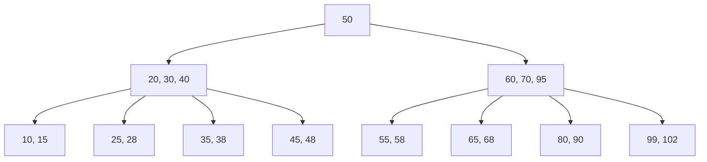

### Deleting from leaf node (causing underflow)
Using the same graph as before this would occur if we remove any key from a leaf node. If we were to remove key 90 the grpah would then look like this:
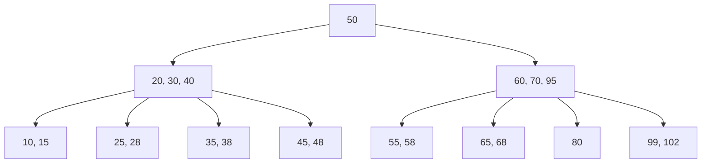

The first method we could fix this is through merging nodes together. Essentially we can combine the two children nodes and the parent node to balance the tree. In this case we would be combining parent node $70$ and its children, which should appear as: 
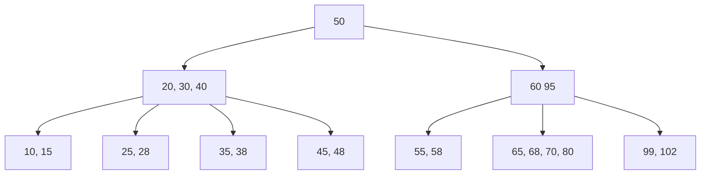


The other option to balance leaf nodes after underflow is through **"borrowing"** values from other leaf nodes. For example, imagine we are removing key 102 from the same graph we were just using:
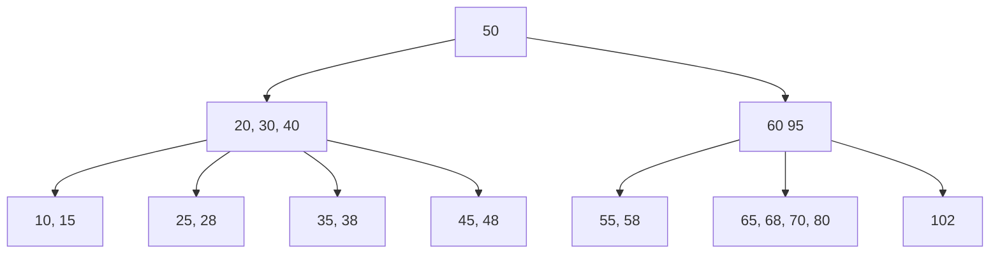
To succesfully borrow and balance this tree we will promote $80$ to the parent node and move $95$ (which was previously in the parent node) to the leaf node that needs another key.
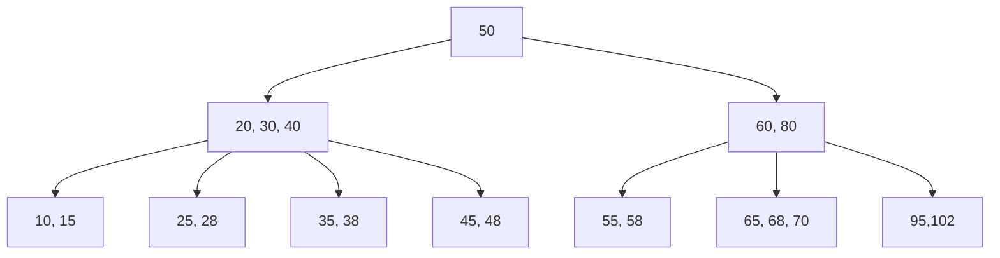

### Deleting internal node key
When we delete an internal node key we need a new key to act as the separator/parent of the nodes. The keys that can assume this role are the greatest value in the left child and the smallest value in the right children (remember that the left child node of that key represents keys that are less than parent and right being values that are greater than parent node)

Continuing to use the same graph as before imagine if we removed 80:
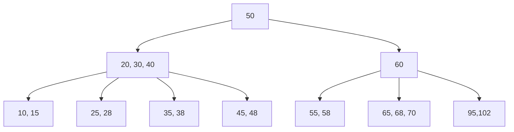
Either 70 or 95 could enter the parent node to act as the separater. In this case if 95 acted as the separator it would result in the leaf node not having sufficient keys, which would then cause the same result as immediately promoting 70.
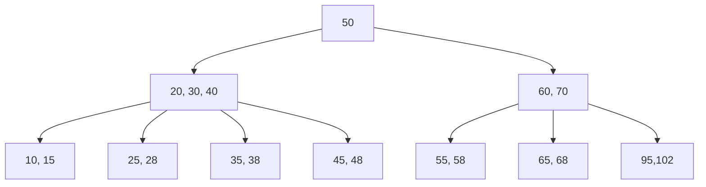
# When would they be used?
First recognize that:
- Computers can quickly and easily compute comparisons
- Reading data in can take a lot longer than comparing values
- B-Trees reduces the number of nodes/levels (aka instances where we read data)

### Example of the first B-Tree as a Binary Search Tree
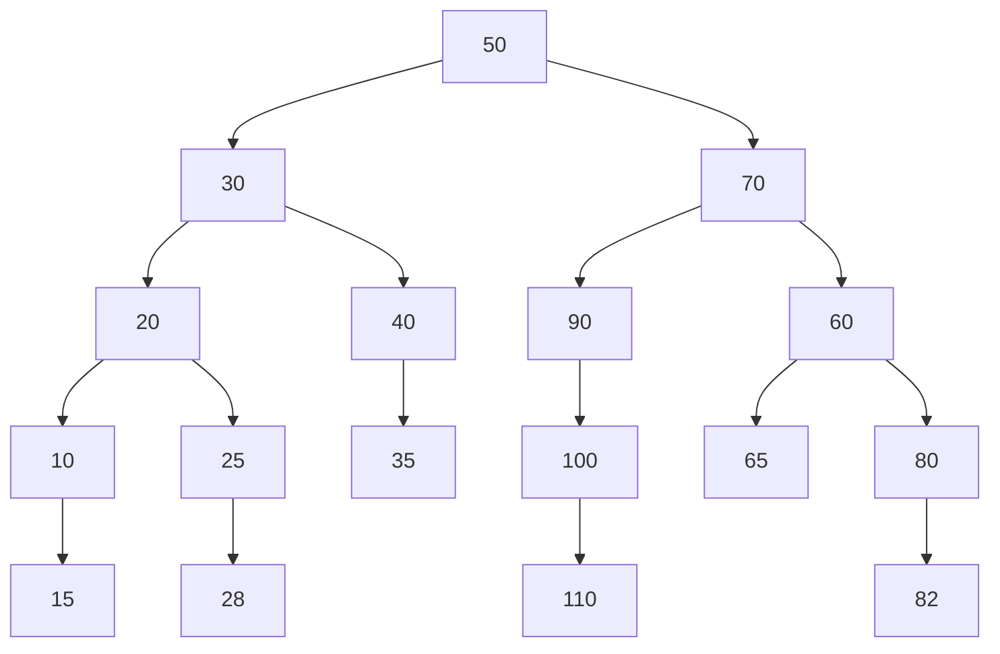

So B-Trees are best used in areas where there is a lot of data as it can reduce the number of times that data has to be slowly read in. Some specific examples of were it would used are:
- File systems:
     - The [Btrfs filesystem](https://en.wikipedia.org/wiki/Btrfs) of linux uses B-Trees
- Databases
    - SQL & other databases actually use B+ trees, whiich is similar but different to B-Trees.
## Sources:

- [B-Trees Wikepedia](https://en.wikipedia.org/wiki/B-tree#Informal_description)
- [B-Tree Video](https://www.youtube.com/watch?v=K1a2Bk8NrYQ)
- [Btrfs Filesystem Wikipedia](https://en.wikipedia.org/wiki/Btrfs)