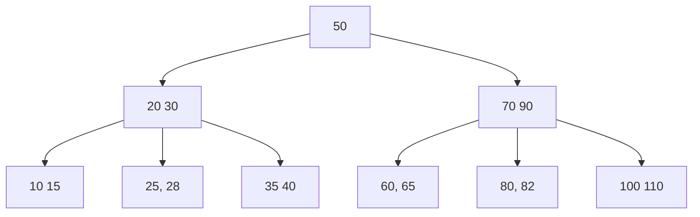
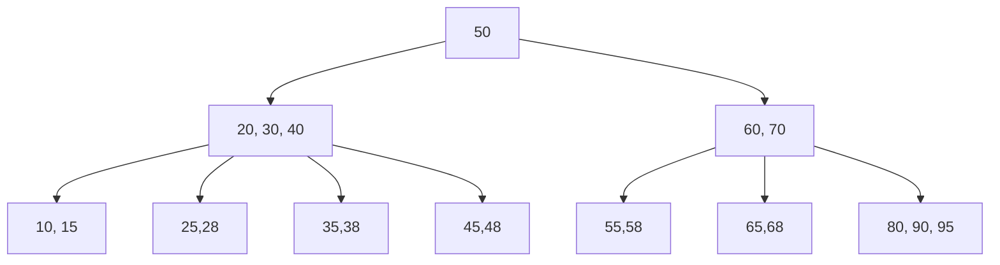
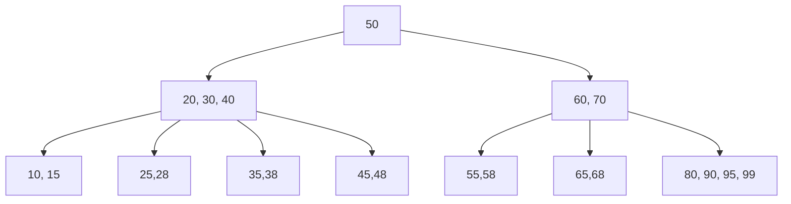
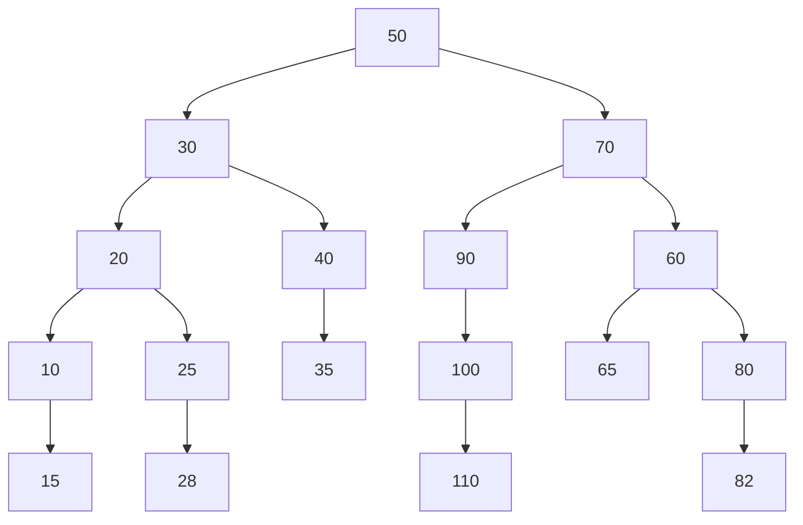

# What Are B-Trees? 
A **B-Tree** is a self-balancing search tree where each node contains multiple values/keys with multiple children. Essentially each node can have $k$ number of keys, which will make the amount of children they have equal to $k+1$. You can also view this as $t$ number of children and $t-1$ number of keys.

General B-Tree Characteristics:
- Every node, except for the root and the leaves, has at least $t$ children.
- Every node has at most $2t$ children.
- The root node has at least two children unless it is a leaf.
- All leaves appear on the same level.
- Each key regardless of whether it is a leaf or internal node points to data.
- A non-leaf node with k children contains k−1 keys.

## Example B-Tree

## What $t$ values could this B-Tree have?

## Insertion:

If we were to insert the number 99 on the B-Tree you just saw it would now look like this. This is the simplest case of insertion as the node doesn't exceed the maximum number of keys it can have.

### After inserting 99:

A more complicated case arises if we were to then insert 100. 

# When would they be used?
First recognize that:
- Computers can quickly and easily compute comparisons
- Reading data in takes longer than comparing values
- B-Trees reduces the number of nodes (aka instances where we read data)

### Example of the first B-Tree as a Binary Search Tree

So B-Trees are best used in areas where there is a lot of data as it can reduce the number of times that data has to be slowly read in. Some specific examples of were it would used are:
- File systems:
     - The [Btrfs filesystem](https://en.wikipedia.org/wiki/Btrfs) of linux uses B-Trees
- Databases
    - SQL & other databases actually use B+ trees, whiich is similar but different to B-Trees.
## Sources:

- [B-Trees Wikepedia](https://en.wikipedia.org/wiki/B-tree#Informal_description)
- [B-Tree Video](https://www.youtube.com/watch?v=K1a2Bk8NrYQ)
- [Btrfs Filesystem Wikipedia](https://en.wikipedia.org/wiki/Btrfs)