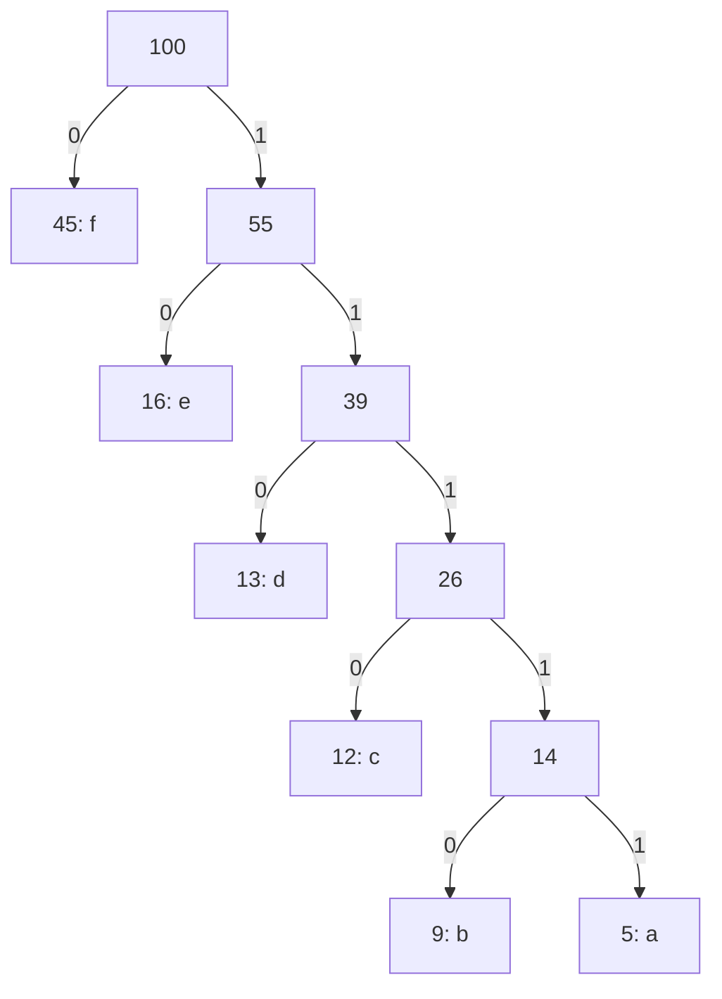

# Huffman Coding Trees

## What is it?

So ASCII assigns each character a value of 8 bits. If this characters were to occur at the same frequency then this method of storing them would actually be the most efficient. However, if the frequency of each character does differ than it actually would be more efficient if the characters that are more frequent had a length of less than 8 bits. This would also mean that the less frequent characters would have a length of bits higher than 8. This is called variable-length codes and it is called Huffman coding (file compression).

The Huffman Coding Tree has leaf nodes representing the characters. The reason for representing this as a tree is because every parent node would have either a left or right node, these directions can be then represented as either a 0 or a 1. This allows us to represent characters in less than 8 bits and the less frequent characters in more than 8 bits.

### Binary: 101010111100110111101111
### Huffman: 1010111011111001100