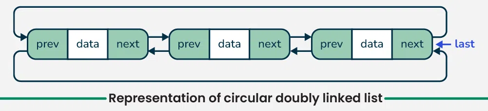
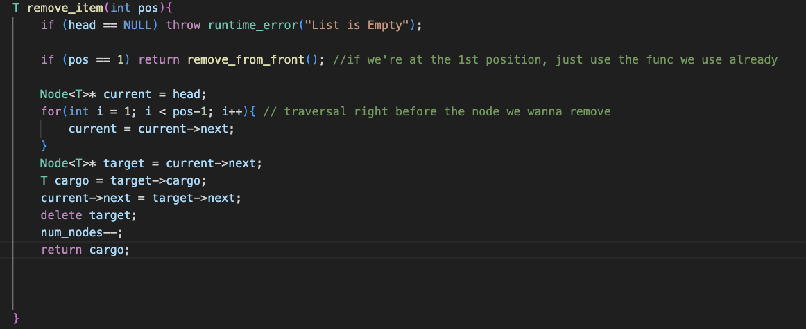
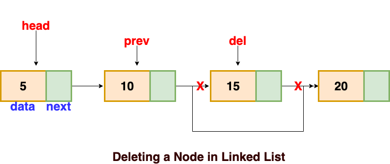

# Get_Item
    Program needs to return cargo at the place specified.

    ```c++:
    T get_item(int pos) {
        // If the position exceeds the number of nodes, reduce it to a valid position using modulo
        if(pos > num_nodes) {return "Position is higher than number of nodes";}

        // Initialize a pointer to traverse the linked list, starting from the head node
        Node<T>* traveler = this->head;

        // Traverse the linked list until reaching the desired position (pos)
        for(int i = 1; i < pos; i++) {
            traveler = traveler->next;
        }

        // Return the cargo (data) stored at the node at the specified position
        return traveler->cargo;
    }
```

# int size()

    This program wants to return the number of items in the list. We can do this through either simply returning the num_nodes variable or through cycling through the entire list until we reach a nullptr. Note that this traversel wouldn't work for other types of linked lists like [circular linked list](https://www.geeksforgeeks.org/circular-linked-list/) as there will never be a nullptr.



    The easiest way to return the correct number of items is through the num_nodes variable and it should always be accurate as long as functions that modify the number of nodes properly adjust num_nodes.
   ```c++:
    int size() {
        return this->num_nodes
    }

//Or we could traverse the entire list until we encounter a nullptr
//This would only works if the linked list is linear

    int size() {
        int count = 0;
        Node<T>* traveler = head;
        while (traveler != nullptr) {
            count++;
            traveler = traveler->next;
        }
        return count;
   }
```

Example Test Cases:

   ```c++:
TEST_CASE("Test Size Grabber") {
    LinkedList<int> list;
    list.insert_at_front(1);
    list.insert_at_front(2);
    list.insert_at_front(3);
    CHECK(list.to_string() == "(3, 2, 1)");
    CHECK(list.IntSize() == "(3)");
}

TEST_CASE("Test Size Grabber after a removal") {
    LinkedList<int> list;
    list.insert_at_front(1);
    list.insert_at_front(2);
    list.insert_at_front(3);
    list.remove_from_front();
    CHECK(list.to_string() == "(2, 1)");
    CHECK(list.IntSize() == "(2)");
}
```

# The Logic Behind Removing a Node in a LinkedList (Anfal)

1. Checking if the List in Empty --> Throw an Error!

2. If the position given in the remove_item function is 1, we already have a function called "remove_from_front" so use that

3. If the position is greater than 1, then we traverse until you're at the Node before you wanna remove.

4. Set the pointer of the Node before the target Node to the Node after the target Node.

5. Delete the Node you want to remove and reduce the num_node count. 


## Code



## Diagram



### Source for Diagram and Logic for LinkedList Deletion:
https://afteracademy.com/blog/types-of-linked-list-and-operation-on-linked-list


# Insert item function

## General concept:

Inserting a node into a linked list involves these key steps:

- **Create the new node**: Allocate memory and store the data.
- **Find the insertion point**: Locate the node before where you want to insert.
- **Reconnect pointers**:


## Cody's Code:

In the `LinkedList` template:

```cpp
void insert_item(Node<T>* before, T cargo);
```

In the rest of the header file:

    ```cpp
template <typename T>
void LinkedList<T>::insert_item(Node<T>* before, T cargo) {
    if (before == nullptr) {
        // Handle insertion at the beginning of the list
        insert_at_front(cargo);
        return;
    }

    Node<T>* after = before->next;  // Node after the insertion point
    Node<T>* newNode = new Node<T>(cargo); // Create the new node

    before->next = newNode; // Connect 'before' to the new node
    newNode->next = after;   // Connect the new node to 'after'

    num_nodes++; // Update the node count
}
```

## Explanation:

1. **Template**: The function is a member of the `LinkedList` class and is templated, so it works with any data type `T`.
2. **Parameters**:
    - `before`: A pointer to the node before the desired insertion point.
    - `cargo`: The data to be stored in the new node.
3. **Handles Insertion at the Beginning**: The function first checks if `before` is `nullptr`. If it is, this means the user wants to insert at the beginning of the list. In this case, it calls the existing `insert_at_front` function to handle the insertion correctly.
4. **Gets the "After" Node**: It gets a pointer to the node that comes after the before node (the node that will be after the new node).
5. **Creates the New Node**: A new `Node` is created with the provided `cargo`.
6. **Reconnects the Links**:
    - `before->next = newNode;` makes the `before` node's `next` pointer point to the newly created node.
    - `newNode->next = after;` makes the new node's `next` pointer point to the `after` node. This re-establishes the connection that was previously between `before` and `after`.
7. **Increments Node Count**: The `num_nodes` counter is incremented to keep track of the list's size.