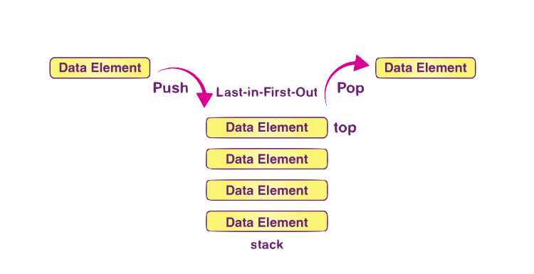

# Evaluate Post-fix Expression

## What is a Post-fix Expression 
A postfix expression is a format that some scientific calculators use to evaluate expressions. The more normal format is infix, where operators are between two operands.  A post-fix expression has the operators follow the operand.

Post-fix example: 11 6 3 / 4 + -
Infix example: (11 - ((6 / 3) + 4))

"A Stack helps to manage the data in the 'Last in First out' method. When the variable is not used outside the function in any program, the Stack can be used. It allows you to control and handle memory allocation and deallocation." - [BYJU](https://byjus.com/gate/stack-and-its-applications/#:~:text=A%20Stack%20helps%20to%20manage,handle%20memory%20allocation%20and%20deallocation.)




```cpp
int eval_postfix_expr(string s) {
    Stack<int> Operands;                        
    vector<string> proc = splitspaces(s);       //Splits the postfix expression into an array of strings
    for(int i = 0; i < proc.size(); i++) {      //For every element in the postfix expression
        string vecval = proc[i];                //Get the current element in the array
        int numoroperator = vecval[0] - '0';    //Convert Char into Int
    
        if(numoroperator >= 0) {                //If the ASCII value is positive (eg. is a number)
            int operand = stoi(vecval);         //"S"tring "TO" "I"nteger
            Operands.push(operand);             //Push to stack
        }

        else {                                          //If the ASCII value is negitive (eg. is a Operator)
            int num = Operands.pop();                   //First Out
            if(numoroperator == ADD) {                  //If Operator is +
                Operands.push(num + Operands.pop());    //Add the two most recent numbers
            }
            if(numoroperator == SUB) {                  //If Operator is -
                Operands.push(Operands.pop() - num);    //Sub the two most recent numbers
            }
            if(numoroperator == MULT) {                 //If Operator is *
                Operands.push(num * Operands.pop());    //Multiply the two most recent numbers
            }
            if(numoroperator == DIV) {                  //If Operator is /
                Operands.push(Operands.pop() / num);    //Divide the two most recent numbers
            }
        }
    }
    return Operands.top();            //Return evaluated result to top of stack
}
```

Test Case: 

```cpp
TEST_CASE("Testing eval_postfix ") {
    CHECK(eval_postfix_expr("5 4 + 2 *" ) == 18);
    CHECK(eval_postfix_expr("12 2 * 4 +") == 28);
    CHECK(eval_postfix_expr("11 6 3 / 4 + -") == 5);
}
```

## Converting Post-Fix to Infix


```cpp
string convertpost_to_infix(string s) {
    int prevop = -1;
    Stack<string> Equation;
    vector<string> proc = splitspaces(s);
    for(int i = 0; i < proc.size(); i++) {
        string vecval = proc[i];
        int numoroperator = vecval[0] - '0'; 
        if(numoroperator >= 0) {
            Equation.push(vecval);
        }
        else {
            string num = Equation.pop();
                if(numoroperator == ADD) {
                    Equation.push( "(" + Equation.pop() + " + "+ num + ")");
                }
                if(numoroperator == SUB) {
                    Equation.push("(" + Equation.pop() + " - " +  num + ")");
                }
                if(numoroperator == MULT) {
                    Equation.push("(" + num + " * "+ Equation.pop() + ")");
                }
                if(numoroperator == DIV) {
                    Equation.push("(" + Equation.pop() + " / " + num + ")");
                }

        }
    }
    
    return Equation.top();
}
```
Test Case:

```cpp
TEST_CASE("Test conversion from postfix to infix") {
    //Convert will always start with parenthesis and will only have spaces between nums and operators but not parentheses
    CHECK(convertpost_to_infix("11 6 3 / 4 + -") == "(11 - ((6 / 3) + 4))");
    //test to see if converstion is a valid infix
    CHECK(is_valid_infix_expression(convertpost_to_infix("11 6 3 / 4 + -")) == true);
}
```